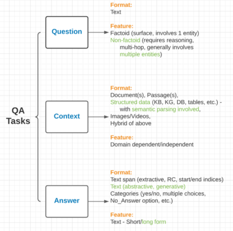

# Annotated Bibliography for Question Answering

Papers and Resources for Question Answering, Semantic Parsing and Data-to-Text in NLP

by Linyong Nan

**Under construction. Order does not matter.**

## Question Answering

We can naively categorize QA datasets/tasks with the criteria shown in the chart above, where we identify the core components of QA as question, context and answer. Different QA datasets have these components in different formats or with different features. Here we attempt to organize them and provide an incomprehensive list of papers as follows. We will include model papers later.

**BAbI (2015)** [[paper](https://arxiv.org/abs/1502.05698)]

Weston et al. proposed a collection of proxy tasks (20 in total) to evaluate reading comprehension capability of a candidate model via question answering. The model is tested whether it is able to give short answers (yes/no, entity, etc) via chaining facts, simple induction, deduction and many more. The tasks are constructed with a simulation which behaves like a classic text adventure game, follows those of Bordes et al. (2010), and Weston et al. (2014)

**SQuAD 1.0 (2016)** [[paper](https://arxiv.org/abs/1606.05250)]

SQuAD 1.0 is a reading comprehension dataset where questions and answers are extracted from the context of Wikipedia articles (open-domain). Answer to each question is a segment of text (text span) from the corresponding reading passage (extractive). Exact match (EM) and Macro-averaged F1 score are used for evaluation.

**SQuAD 2.0 (2018)** [[paper](https://arxiv.org/abs/1806.03822)]

Unanswerable questions are added to SQuAD 1.0 to test whether a candidate model can not only answer questions when possible, but also determine when no answer is supported by the paragraph. These questions are written adversarially by crowdworkers to look similar to answerable ones.

**MS MARCO (2018)** [[paper](https://arxiv.org/abs/1611.09268)]

Bajaj et al. released a large-scale (> 1M questions) reading comprehension QA dataset, where questions are sampled from Bing's search query logs and answers are either generated or rewritten by human. They proposed three tasks with the dataset: (1) determine if a question is answerable given the retrieved web documents/passages as context, and extract and synthesize the answer (extractive), (2) generate answer based on the context passages (abstractive), (3) rank a set of retrieved passages given a question. Both EM/F1 and BLEU/ROUGE are used for evaluation.

**TriviaQA (2017)** [[paper](https://arxiv.org/abs/1705.03551)]

c3

**NarrativeQA (2017)** [[paper](https://arxiv.org/abs/1712.07040)]

c4

**CoQA (2019)** [[paper](https://arxiv.org/abs/1808.07042)]

d

**HotpotQA (2019)** [[paper](https://arxiv.org/abs/1809.09600)]

e

**Natural Questions (2019)** [[paper](https://research.google/pubs/pub47761/)]

f

**DROP (2019)** [[paper](https://arxiv.org/abs/1903.00161)]

g

**ELI5 (2019)** [[paper](https://arxiv.org/abs/1907.09190)]

g2

**WikiTQ (2015)** [[paper](https://arxiv.org/abs/1508.00305)]

h

**SequentialQA (2017)** [[paper](https://www.aclweb.org/anthology/P17-1167/)]

For exploring a realistic, conversational QA setting, Iyyer et al. collected a new table QA dataset by decomposing complicated questions samples from WikiTQ dataset into multiple easier ones, therefore the model is tasked to answer sequences of simple but inter-related questions instead of a single long, complicated and unnatural question. A novel dynamic neural semantic parsing framework is proposed that train using a weakly supervised reward-guided search, this model leverages the sequential contexts to outperform SOTA QA models.

**HybridQA (2020)** [[paper](https://arxiv.org/abs/2004.07347)]

i

**OTT-QA (2020)** [[paper](https://arxiv.org/abs/2010.10439)]

j

**TAPAS (2020)** [[paper](https://arxiv.org/abs/2004.02349)]

k

## Semantic Parsing on Structured Knowledge

**WikiSQL (2017)** [[paper](https://arxiv.org/abs/1709.00103)]

a

**Spider (2019)** [[paper](https://arxiv.org/abs/1809.08887)]

b

**SParC (2019)** [[paper](https://arxiv.org/abs/1906.02285)]

c

## Data-to-Text Generation

**ROTOWire (2017)** [[paper](https://arxiv.org/abs/1707.08052)]

a

**LogicNLG (2020)** [[paper](https://arxiv.org/abs/2004.10404)]

b

**ToTTo (2020)** [[paper](https://arxiv.org/abs/2004.14373)]

c

**DART (2020)** [[paper](https://arxiv.org/abs/2007.02871)]

c2

**TabFact (2020)** [[paper](https://arxiv.org/abs/1909.02164)]

d

**Logic2Text (2020)** [[paper](https://arxiv.org/abs/2004.14579)]

e

**KGPT (2020)** [[paper](https://arxiv.org/abs/2010.02307)]

f

**PLMS4G2T (2020)** [[paper](https://arxiv.org/abs/2007.08426)]

g
